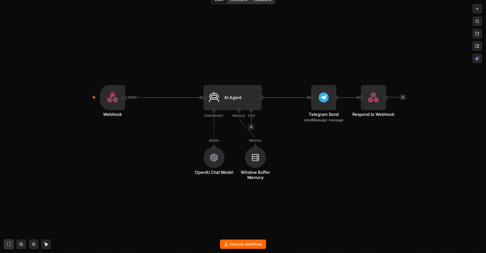

# customer-support-agent

Telegram AI support bot with per-chat memory. Poller bridges Telegram `getUpdates` long polling to local `Webhook` so no public HTTPS is required.

## Use case

Automates first-line support in Telegram DM / groups: answers FAQ, qualifies requests, and escalates with context. One reply per message, no spam.

**Where to use**
- Support DM for small business / SaaS
- Group moderator answering repeated questions
- Internal helpdesk via Telegram

## Graph



`Webhook POST /webhook/telegram → AI Agent (system: helpful support, concise RU) → OpenAI Chat Model (inclusionai/ling-3.0-flash-fin:free via OpenRouter) + Window Buffer Memory (sessionKey = chat.id, window 10) → Telegram Send → Respond {"ok": true}`

Poller `poller.py` (root) does `GET getUpdates?offset=OFFSET&timeout=30` → `POST http://localhost:5678/webhook/telegram`. Single consumer, `OFFSET = max(update_id)+1`, long polling.

## Workflow

- `workflow.json` — import to n8n `a6faedfd-5061-4e74-ac24-19ab2218a475` `Webhook 2`, `Agent 1.8`, `lmChatOpenAi 1.2`, `telegram 1.2`, `respondToWebhook 1.1`, `memoryBufferWindow 1.3`
- `preview.png` — auto-generated graph

## Triggers

- **Webhook** `POST /webhook/telegram` `webhookId a85e705e-a79f-47f4-b183-121603f310` `responseMode: responseNode`. Body is Telegram `Update` `{ update_id, message: { chat, text } }`. With `poller.py` → no `setWebhook`. Without poller, expose via `https://<domain>/webhook/telegram` and use `Telegram Trigger` variant.

## Variables / Credentials

| Variable | Where | Required | Example |
| --- | --- | --- | --- |
| `TELEGRAM_BOT_TOKEN` | `.env` + `poller.py` env + n8n `telegramApi` credential `1a2b3c4d...` | Yes | `123456:ABC-DEF1234ghIkl-zyx57W2v1u123ew11` |
| `OPENAI_API_KEY` | `.env` + n8n `openAiApi` `2a2b3c4d...` + Base URL `https://openrouter.ai/api/v1` for OpenRouter | Yes | `sk-or-v1-47cb...` |
| `N8N_ENCRYPTION_KEY` | `.env` | Yes | random 32 chars |
| `POSTGRES_HOST/PORT` | `.env` `127.0.0.1:5433` host network `network_mode: host` | No (only if using RAG) | `127.0.0.1` |

`AI Agent.text` `={{ $json.body.message.text || $json.body.message.caption || '' }}` `Telegram.chatId` `={{ $('Webhook').item.json.body.message.chat.id }}` `Memory.sessionKey` `={{ $('Webhook').item... }}` — per-chat isolation verified `chatId 5785127604`.

## Quick start

```bash
cp ../.env.example ../.env  # set TELEGRAM_BOT_TOKEN, OPENAI_API_KEY
docker compose up -d  # n8n :5678
# n8n UI http://localhost:5678 -> Credentials -> Telegram + OpenAI
# Import: Workflows -> Import from File -> customer-support-agent/workflow.json -> Activate
curl https://api.telegram.org/bot$TELEGRAM_BOT_TOKEN/deleteWebhook?drop_pending_updates=true
python3 -u ../poller.py > /tmp/poller.log 2>&1 &
# test: curl -X POST http://localhost:5678/webhook/telegram -d '{"update_id":1,"message":{"chat":{"id":123},"text":"hi"}}'
```

## Gotchas

- `No prompt specified` → Webhook wraps in `body`, use `$json.body.message.text`
- `chat_id empty` after Agent → use `$('Webhook').item.json.body.message.chat.id`
- `ECONNREFUSED 149.154.166.110:443` in bridge → `network_mode: host`
- `409 Conflict` → only one poller per token

## Showcase

Real execution proof — see [showcase/README.md](showcase/README.md):
- `showcase/execution.png` — n8n execution success
- `showcase/telegram-chat.png` — Telegram chat proof
- `showcase/poller-log.png` — poller log proof
