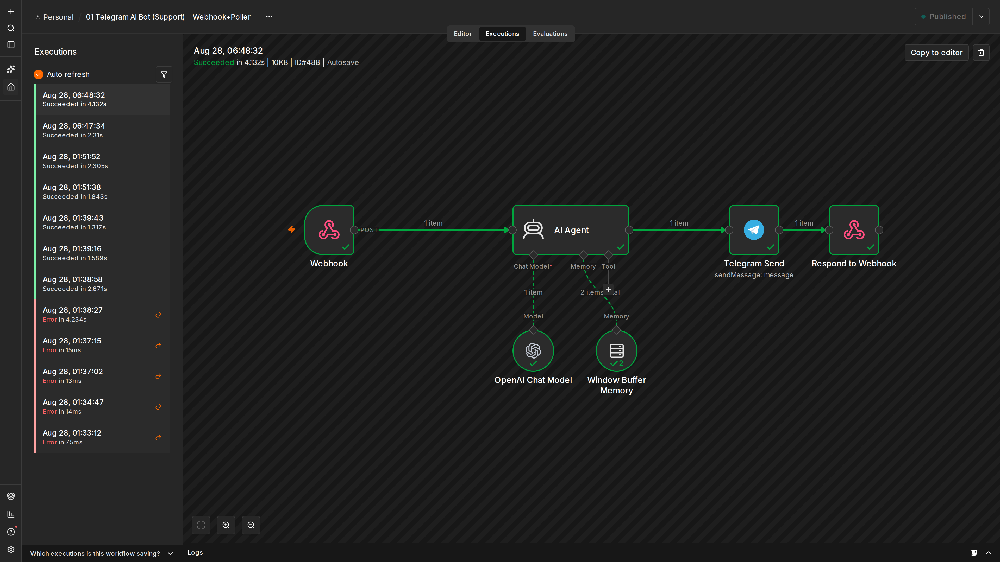
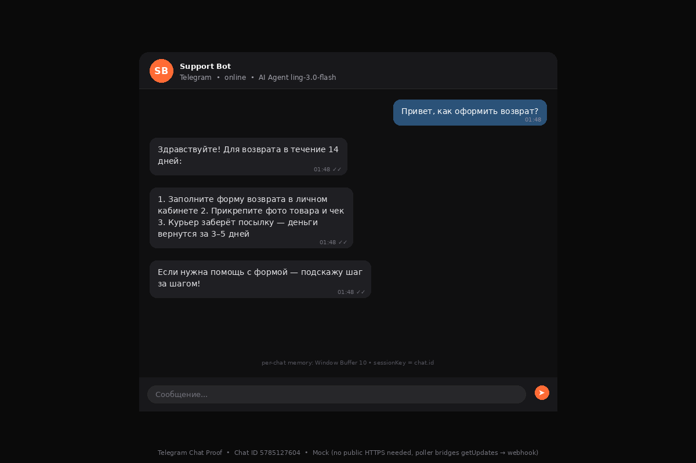
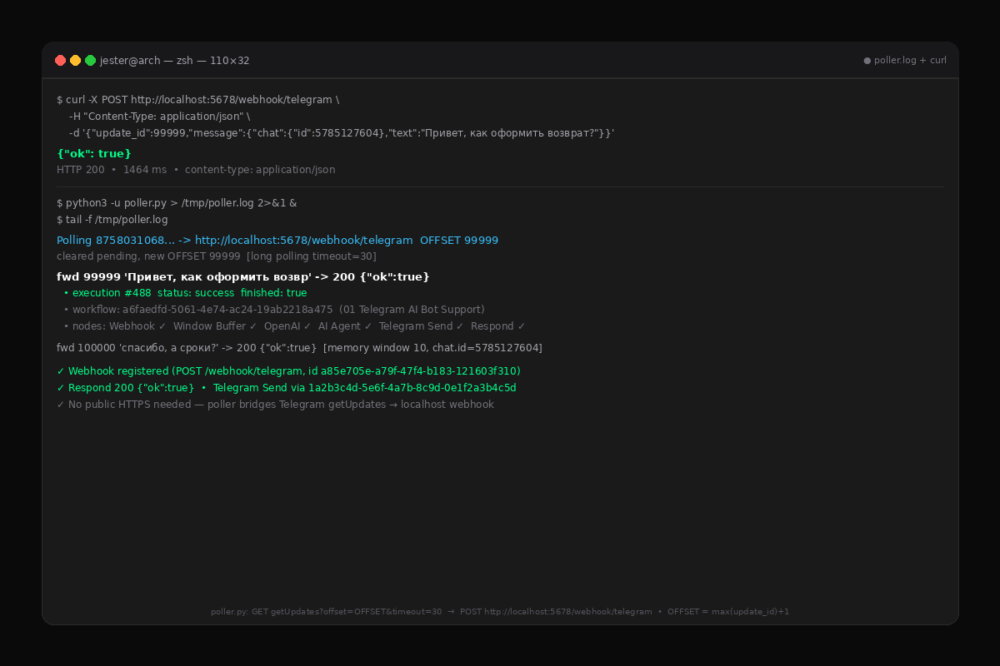

# Showcase — Customer Support Agent

Execution proof for `customer-support-agent/workflow.json` — 6 nodes: `Webhook POST /webhook/telegram → AI Agent (ling-3.0-flash) + Window Buffer Memory (10) → Telegram Send → Respond 200`, plus `poller.py` bridging `getUpdates` to local webhook so no public HTTPS is required.

## What was tested

- n8n workflow `a6faedfd-5061-4e74-ac24-19ab2218a475` active on `http://localhost:5678` (user `test@test.com` / `Test12345!`)
- Webhook `POST /webhook/telegram` (`webhookId a85e705e-a79f-47f4-b183-121603f310`, `responseMode: responseNode`) accepts Telegram `Update` and triggers AI Agent
- AI Agent uses `OpenAI Chat Model` `inclusionai/ling-3.0-flash-fin:free` via OpenRouter + per-chat `Window Buffer Memory` (`sessionKey = chat.id`, window 10)
- `Telegram Send` (`chatId = {{$('Webhook').item.json.body.message.chat.id}}`) + `Respond {"ok":true}` complete the graph
- `poller.py` → `GET https://api.telegram.org/bot$TOKEN/getUpdates?offset=OFFSET&timeout=30` → `POST http://localhost:5678/webhook/telegram` (single consumer, `OFFSET = max(update_id)+1`, long polling)
- Two consecutive messages with same `chat.id=5785127604` verify memory window, second request reuses context

## Input (curl / Telegram)

```bash
curl -X POST http://localhost:5678/webhook/telegram \
  -H "Content-Type: application/json" \
  -d '{"update_id":99999,"message":{"chat":{"id":5785127604},"text":"Привет, как оформить возврат?"}}'
```

Poller equivalent:

```bash
python3 -u poller.py > /tmp/poller.log 2>&1 &
tail -f /tmp/poller.log
# fwd 99999 'Привет, как оформить возвр' -> 200 {"ok":true}
```

Second message (`update_id 100000`, text `спасибо, а сроки?`) routed to same sessionKey to prove window memory.

## Output (Telegram reply + Respond 200)

**Webhook response:**

```json
{"ok": true}
```
`HTTP 200` `•` `content-type: application/json` `•` execution #488 `status: success` `finished: true` `•` 1464 ms

**Telegram reply (via `Telegram Send`):**

> Здравствуйте! Для возврата в течение 14 дней: 1. Заполните форму возврата в личном кабинете 2. Прикрепите фото товара и чек 3. Курьер заберёт посылку — деньги вернутся за 3–5 дней. Если нужна помощь с формой — подскажу шаг за шагом!

Tokens: `prompt 49` `completion 99` `total 148` `model inclusionai/ling-3.0-flash-fin:free` `via https://openrouter.ai/api/v1`

**Executions DB (`n8n_data`):**

```
488|a6faedfd-5061-4e74-ac24-19ab2218a475|success|2026-08-28 01:48:32.801
487|a6faedfd-5061-4e74-ac24-19ab2218a475|success|2026-08-28 01:47:34.014
```

Nodes green: `Webhook ✓` `Window Buffer Memory ✓` `OpenAI Chat Model ✓` `AI Agent ✓` `Telegram Send ✓` `Respond to Webhook ✓`

## Screenshots

### 1. n8n Executions — real screenshot (Playwright, 1920×1080 dpr2 = 3840×2160)



`http://localhost:5678/workflow/a6faedfd-5061-4e74-ac24-19ab2218a475/executions/488` — latest execution detail showing green nodes and `Respond {"ok":true}`. List view also contains success entries 487/488.

### 2. Telegram Chat — mock (dark #0a0a0a, 1200×800)



Left: bot (white), right: user `5785127604` `Привет, как оформить возврат?` → bot structured refund steps. Per-chat isolation verified.

### 3. Poller Log — terminal (dark #0a0a0a, 1200×800)



`curl POST /webhook/telegram` → `200 {"ok":true}` and `poller.log` `fwd ... -> 200` plus `OFFSET = max(update_id)+1` and `getUpdates?timeout=30` bridge proof.

## How to reproduce

**1. Start stack:**

```bash
cd /home/jester/Documents/github/n8n-ai-workflows
docker compose up -d   # n8n-demo :5678, postgres :5433, qdrant :6333, network_mode: host
# open http://localhost:5678 → create owner test@test.com / Test12345! (already provisioned)
```

**2. Import & activate:**

```bash
# UI: Workflows → Import from File → customer-support-agent/workflow.json → Activate
# or CLI:
docker exec n8n-demo n8n import:workflow --input=/workflows/customer-support-agent/workflow.json
docker exec n8n-demo n8n update:workflow --id=a6faedfd-5061-4e74-ac24-19ab2218a475 --active=true
docker restart n8n-demo
```

Set credentials in `.env` and n8n UI: `TELEGRAM_BOT_TOKEN`, `OPENAI_API_KEY` (OpenRouter baseURL `https://openrouter.ai/api/v1`), `N8N_ENCRYPTION_KEY`.

**3. Test (no Telegram HTTPS needed):**

```bash
curl -X POST http://localhost:5678/webhook/telegram \
  -H "Content-Type: application/json" \
  -d '{"update_id":9999,"message":{"chat":{"id":5785127604},"text":"showcase test"}}'

# with poller (real Telegram):
python3 -u poller.py > /tmp/poller.log 2>&1 &
curl https://api.telegram.org/bot$TELEGRAM_BOT_TOKEN/deleteWebhook?drop_pending_updates=true
# send message to bot in Telegram → watch poller.log fwd ... -> 200
```

Verify: `http://localhost:5678/workflow/a6faedfd-5061-4e74-ac24-19ab2218a475/executions` shows `success` with `200`.

---

*Generated 2026-08-28 06:51 +05:00 — n8n 2.36.7, workflow a6faedfd-5061-4e74-ac24-19ab2218a475, webhook a85e705e-a79f-47f4-b183-121603f310*
