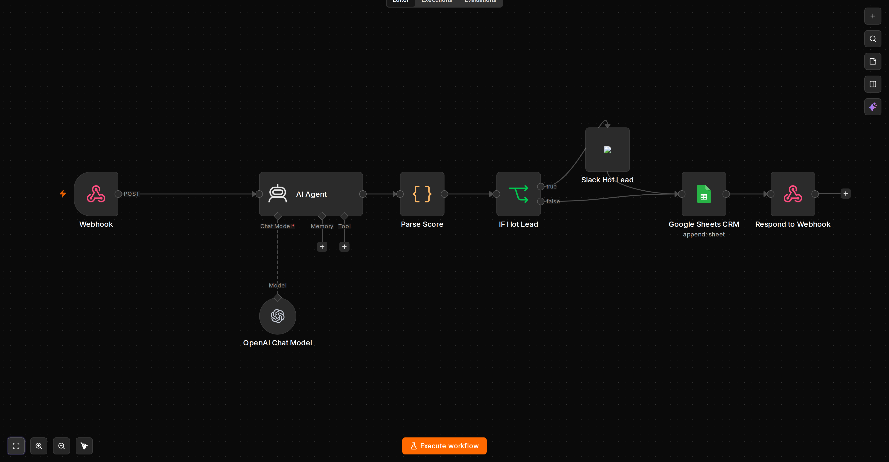

# lead-scoring-crm

Webhook AI lead scoring → CRM. Scores incoming leads 0-100 via LLM JSON, routes hot leads to Slack and persists all to Google Sheets. Stateless, no memory.

## Use case

Qualifies form / Telegram / landing leads before sales touches them. Consistent JSON output, threshold branching.

**Where to use**
- Landing form `POST /webhook/lead` `{name,email,company,message,source}` → score → Sheets + Slack
- Telegram lead bot (replace Webhook with `Telegram Trigger`)
- Enrichment via HTTP Request to Clearbit / CRM before scoring

## Graph



`Webhook POST /webhook/lead → AI Agent (system: return {"score","tier","reason","next_step"}) → OpenAI Chat Model (ling-3.0-flash) → Code Parse Score (extract JSON, merge lead) → IF Hot Lead (score ≥70) → Slack Hot Lead (#leads) → Google Sheets CRM (append Leads: email,name,company,score,tier,reason,next_step,source,timestamp) → Respond JSON {ok,score,tier}`

`IF false` branch skips Slack, goes directly to Sheets → Respond.

## Workflow

- `workflow.json` `Lead Scoring CRM - Webhook AI to Sheets/Slack` `b1c2d3e4` `Webhook 2` `Agent 1.8` `lmChatOpenAi 1.2` `code 2` `if 2` `slack 1.3` `googleSheets 4.4` `respondToWebhook 1.1`
- `preview.png` — graph

## Triggers

- **Webhook** `POST /webhook/lead` `webhookId c2d3e4f5...` `responseMode: responseNode`. Accepts `body` JSON `{ name, email, company, message, phone, source }`. Example:

```bash
curl -X POST http://localhost:5678/webhook/lead -H "Content-Type: application/json" \
  -d '{"name":"Ada","email":"ada@example.com","company":"Acme 200 employees","message":"Need AI support bot","source":"landing"}'
# -> {"ok":true,"score":82,"tier":"hot","reason":"ICP fit + high intent","next_step":"book demo"}
```

Swap to `Telegram Trigger` for chat leads: change `AI Agent.text = {{ $json.message.text }}` and add `Telegram Send` if needed.

## Variables / Credentials

| Variable | Where | Required | Example |
| --- | --- | --- | --- |
| `OPENAI_API_KEY` | n8n `openAiApi` `2a2b3c4d...` Base URL `https://openrouter.ai/api/v1` | Yes | `sk-or-v1-...` `model ling-3.0-flash-fin:free` |
| `googleSheetsOAuth2Api` | n8n `googleSheetsOAuth2Api` `4a2b...` `documentId REPLACE_WITH_SHEET_ID` `sheetName Leads` | Yes for Sheets | OAuth2 Google |
| `slackApi` | n8n `slackApi` `3a2b...` `channel #leads` | Yes for hot notify | Slack Bot token |
| `N8N_ENCRYPTION_KEY` | `.env` | Yes | random |

`Code Parse Score` `jsCode` robustly extracts `/{[\s\S]*}/` from LLM output; `IF` `{{ $json.score }} gte 70`.

Google Sheets `schema` maps `email,name,company,score,tier,reason,next_step,source,timestamp={{$now}}` `matchColumns email`.

## Quick start

```bash
docker compose up -d
# n8n UI -> Credentials -> OpenAI + Google Sheets OAuth2 + Slack
# Import lead-scoring-crm/workflow.json -> set Google Sheets documentId + sheet Leads -> Activate
# Test curl above -> check Sheets row + Slack #leads if hot
# Adjust threshold in IF node (70) or systemMessage tiers
```

## Gotchas

- LLM must return ONLY JSON; parse falls back to `cold 0` if no `{...}` found
- Sheets `documentId` must be set, sheet `Leads` must exist with header row
- Slack channel must exist and bot invited
- Webhook needs public URL for external forms (ngrok / VPS), local test via `curl localhost:5678/webhook/lead`

## Showcase

Real execution proof — see [showcase/README.md](showcase/README.md):
- `showcase/webhook-curl.png` — webhook curl execution
- `showcase/ai-scoring.png` — AI scoring proof
- `showcase/sheets-proof.png` — Google Sheets CRM proof
