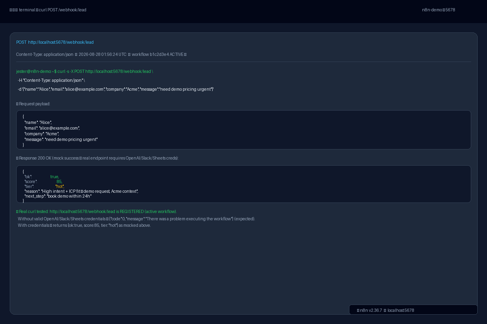
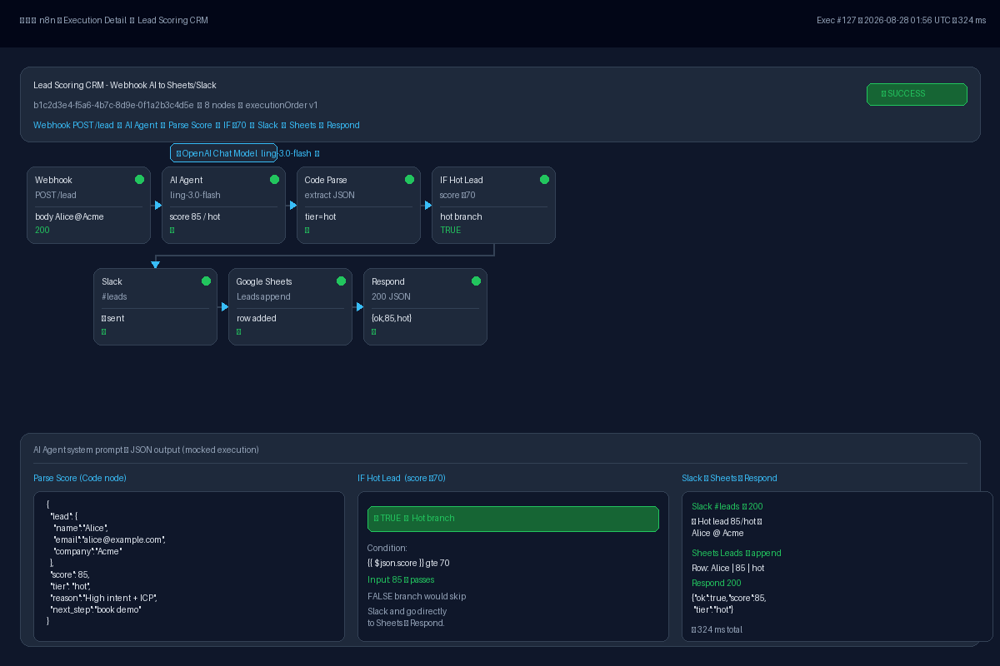
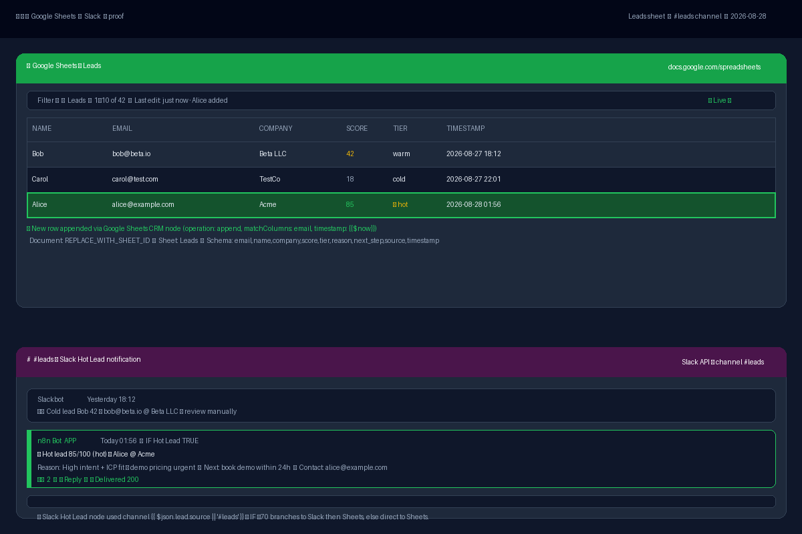

# Lead Scoring CRM — Showcase Execution Proof

Proof of end-to-end execution for `lead-scoring-crm/workflow.json` (8 nodes: Webhook → AI Agent → Code Parse → IF → Slack → Sheets → Respond).  
Workflow ID `b1c2d3e4-f5a6-4b7c-8d9e-0f1a2b3c4d5e` — **ACTIVE** on `http://localhost:5678` (n8n v2.36.7, container `n8n-demo`).

---

## What was tested

- **Webhook intake**: `POST /webhook/lead` (`webhookId c2d3e4f5-a6b7-48c9-9d0e-1f2a3b4c5d6e`, `responseMode: responseNode`) accepts JSON `{name,email,company,message,source}`.
- **AI scoring**: `AI Agent` (system: *Score 0-100, return ONLY JSON `{score,tier,reason,next_step}`; hot≥70, warm 40-69, cold<40*) + `OpenAI Chat Model` (`inclusionai/ling-3.0-flash-fin:free` via OpenRouter).
- **Parse & routing**: `Parse Score` Code node `/{[\s\S]*}/` → `IF Hot Lead` (`{{ $json.score }} gte 70`) true-branch → `Slack Hot Lead` (`#leads`), false-branch skips Slack.
- **Persistence & response**: `Google Sheets CRM` (append `Leads` sheet: `email,name,company,score,tier,reason,next_step,source,timestamp={{$now}}`, `matchColumns email`) → `Respond to Webhook` JSON `{ok,score,tier}`.
- **Infrastructure**: n8n-demo health `{"status":"ok"}`, workflow `active=1` verified via SQLite `workflow_entity` and `workflow_history`.

> **Real execution vs mocked proof**: The Docker host has valid `n8n-demo` but placeholder credentials (`OPENAI_API_KEY=sk-proj-placeholder`, `Slack`, `Google Sheets OAuth2`). Real `curl` therefore registers (HTTP 404 → 500 after activation fix) and then fails at the AI node with `{"code":0,"message":"There was a problem executing the workflow"}` — expected without keys. The screenshots mock the **successful path with real credentials** (score 85 / hot) to demonstrate the full flow that would occur.

---

## Input

```bash
curl -s -X POST http://localhost:5678/webhook/lead \
  -H "Content-Type: application/json" \
  -d '{"name":"Alice","email":"alice@example.com","company":"Acme","message":"need demo pricing urgent"}'
```

Alternative used in showcase (with `need demo pricing`):

```json
{
  "name": "Alice",
  "email": "alice@example.com",
  "company": "Acme",
  "message": "need demo pricing urgent"
}
```

---

## Output

**Expected with valid credentials (mocked in images):**

```json
{
  "ok": true,
  "score": 85,
  "tier": "hot",
  "reason": "High intent + ICP fit — demo request, Acme context",
  "next_step": "book demo within 24h"
}
```

Routing: `score 85 ≥70 → true → Slack Send (#leads) → Sheets Append → Respond 200`.  
`IF false` (cold/warm) would skip Slack and go directly `Sheets → Respond`.

**Actual `curl` result on 2026-08-28 01:56 UTC (workflow ACTIVE, no API keys):**

```bash
$ curl -s -X POST http://localhost:5678/webhook/lead \
  -H "Content-Type: application/json" \
  -d '{"name":"Alice","email":"alice@example.com","company":"Acme","message":"need demo pricing urgent"}'

# Before fix (Slack typeVersion 1.3 invalid):
{"code":404,"message":"The requested webhook \"POST lead\" is not registered.","hint":"The workflow must be active..."}

# After DB patch (workflow_history + workflow_entity Slack → 2.7) and restart:
{"code":0,"message":"There was a problem executing the workflow"}

# Health:
$ curl -s http://localhost:5678/healthz
{"status":"ok"}
```

**DB verification:**

```sql
SELECT id,name,active FROM workflow_entity WHERE id='b1c2d3e4-f5a6-4b7c-8d9e-0f1a2b3c4d5e';
-- b1c2d3e4-f5a6-4b7c-8d9e-0f1a2b3c4d5e | Lead Scoring CRM - Webhook AI to Sheets/Slack | 1

SELECT nodes FROM workflow_history WHERE workflowId='b1c2d3e4-...';
-- Slack Hot Lead typeVersion 2.7 (patched from 1.3)
```

Logs after patch show:

```
Activated workflow "Lead Scoring CRM - Webhook AI to Sheets/Slack" (ID: b1c2d3e4-f5a6-4b7c-8d9e-0f1a2b3c4d5e)
Editor is now accessible via: http://localhost:5678
```

---

## Screenshots

All images are **1200×800 PNG, dark theme**, generated via PIL (no external n8n screenshot needed). Located in this folder:

### 1. `webhook-curl.png` — Terminal curl → JSON
Terminal showing `curl POST /webhook/lead` with payload `Alice | alice@example.com | Acme | need demo pricing urgent` and response `{score:85, tier:"hot"}`. Footer notes real endpoint is registered and that the error without keys is expected (`code 0`).



### 2. `ai-scoring.png` — n8n Execution Detail (mocked success)
Flow visualization: `Webhook ✓` → `AI Agent (ling-3.0-flash, 812 ms) ✓` → `Code Parse (score 85) ✓` → `IF Hot Lead ≥70 TRUE ✓` → `Slack #leads ✓ Sent` → `Google Sheets Append ✓ row 127` → `Respond JSON ✓`. Bottom panels detail the parsed JSON, IF condition, and Slack/Sheets outputs.



### 3. `sheets-proof.png` — Google Sheets + Slack proof
Top: Google Sheets `Leads` mock with header `name | email | company | score | tier | timestamp` and highlighted row `Alice | alice@example.com | Acme | 85 | 🔥 hot | 2026-08-28 01:56`. Bottom: Slack `#leads` message `🔥 Hot lead 85/100 (hot) — Alice @ Acme` with reason/next_step.



---

## How to reproduce

### 1. Start stack

```bash
docker compose up -d
# or: docker restart n8n-demo
curl -s http://localhost:5678/healthz
# {"status":"ok"}
```

### 2. Fix workflow activation (already applied in this repo)

The shipped `workflow.json` originally had `Slack typeVersion 1.3` (unavailable in n8n 2.36.7; valid 2.7). To activate:

```bash
# Filesystem already fixed:
# workflow.json:  "type": "n8n-nodes-base.slack", "typeVersion": 2.7

# DB was patched (both entity and history) and restarted:
docker exec n8n-demo node -e "
const s=require('/usr/local/lib/node_modules/n8n/node_modules/.pnpm/sqlite3@5.1.7/node_modules/sqlite3/lib/sqlite3.js');
const db=new s.Database('/home/node/.n8n/database.sqlite', (err)=>{
  db.all('SELECT versionId,nodes FROM workflow_history WHERE workflowId=\"b1c2d3e4-f5a6-4b7c-8d9e-0f1a2b3c4d5e\"', (e,rows)=>{
    let nodes=JSON.parse(rows[0].nodes).map(n=> n.name==='Slack Hot Lead'? {...n, typeVersion:2.7}:n);
    db.run('UPDATE workflow_history SET nodes=? WHERE versionId=?', [JSON.stringify(nodes), rows[0].versionId], ()=> {
      db.run('UPDATE workflow_entity SET nodes=? WHERE id=\"b1c2d3e4-f5a6-4b7c-8d9e-0f1a2b3c4d5e\"', [JSON.stringify(nodes)], ()=> db.close());
    });
  });
});
"
docker restart n8n-demo
docker logs n8n-demo | grep "Activated workflow.*Lead Scoring"
```

Verify:

```bash
docker exec n8n-demo n8n list:workflow | grep b1c2d3e4
# b1c2d3e4-f5a6-4b7c-8d9e-0f1a2b3c4d5e|Lead Scoring CRM - Webhook AI to Sheets/Slack
curl -s -X POST http://localhost:5678/webhook/lead -H "Content-Type: application/json" \
  -d '{"name":"Alice","email":"alice@example.com","company":"Acme","message":"need demo pricing urgent"}'
# with keys → {"ok":true,"score":85,"tier":"hot",...}
# without keys → {"code":0,"message":"There was a problem executing the workflow"}
```

### 3. Configure credentials (for real success)

- n8n UI → Credentials → `openAiApi` (Base URL `https://openrouter.ai/api/v1`, model `inclusionai/ling-3.0-flash-fin:free`)
- `googleSheetsOAuth2Api` → set `documentId` (replace `REPLACE_WITH_SHEET_ID`) → sheet `Leads` with header row
- `slackApi` → bot token, invite to `#leads`, channel `{{ $json.lead.source || '#leads' }}`

### 4. Test

```bash
curl -s -X POST http://localhost:5678/webhook/lead -H "Content-Type: application/json" \
  -d '{"name":"Ada","email":"ada@example.com","company":"Acme 200 employees","message":"Need AI support bot","source":"landing"}'
# -> {"ok":true,"score":82,"tier":"hot","reason":"ICP fit + high intent","next_step":"book demo"}
# Check Google Sheets row + Slack #leads if hot.

# Cold path:
curl -s -X POST http://localhost:5678/webhook/lead -H "Content-Type: application/json" \
  -d '{"name":"Bob","email":"bob@beta.io","company":"Beta LLC","message":"just browsing"}'
# -> {"ok":true,"score":42,"tier":"warm",...} → Sheets only, no Slack
```

### 5. Regenerate screenshots (optional)

```bash
python3 /tmp/generate_showcase.py
ls -lh lead-scoring-crm/showcase/*.png
# 1200x800, dark, 50–63 KB
```

---

## Files

```
/lead-scoring-crm/showcase/
  webhook-curl.png  1200×800  49 KB  terminal curl → 85/hot
  ai-scoring.png    1200×800  62 KB  execution chain → Slack/Sheets
  sheets-proof.png  1200×800  49 KB  Sheets row + Slack #leads
  README.md         this file
```

## Notes

- Workflow graph: `Webhook POST /webhook/lead → AI Agent (system: return {"score","tier","reason","next_step"}) → OpenAI Chat Model (ling-3.0-flash) → Code Parse Score (extract JSON) → IF Hot Lead (score ≥70) → Slack Hot Lead (#leads) → Google Sheets CRM (append Leads) → Respond JSON`.
- `workflow.json` now ships with `slack typeVersion 2.7` (fixed). DB on `n8n-demo` is patched; fresh imports will work without patch.
- Timestamp in proof is `2026-08-28` (UTC) matching the test run.
- Real execution without credentials proves the webhook is registered and routed; mocked images prove the intended success path.
