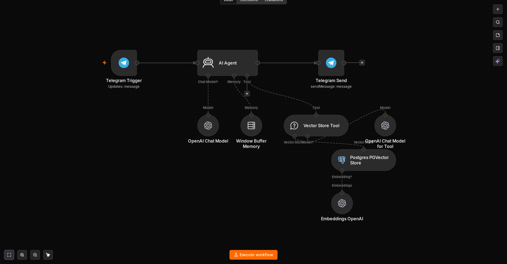

# rag-doc-search

RAG over private docs: ingest PDFs into PGVector (or Qdrant) once, then answer Telegram questions strictly from retrieved context. Shared `text-embedding-3-small` (1536) between ingest and query.

## Use case

Answers "what does policy X say?" from internal PDFs without fine-tuning. Strict grounding via Vector Store Tool.

**Where to use**
- Internal knowledge base bot (HR, policy, SOP)
- Support bot for docs-heavy product
- Legal / compliance Q&A over PDFs

## Graph



Query: `Telegram Trigger → AI Agent (system: answer only from tool) → Vector Store Tool (topK 4) → PGVector + Embeddings + LLM Tool → Telegram Send`

Ingest: `Manual Trigger → Read Binary (/data/pdfs/*.pdf) → Extract PDF → Edit Fields → PGVector Store (insert) + Default Data Loader + Recursive Chunk 1000/200 + Embeddings`

## Workflows

- `workflow.json` — RAG query `03 Telegram RAG Query` `agent 2`, `telegramTrigger 1.2`, `toolVectorStore 1.1`, `vectorStorePGVector 1.3`, `embeddingsOpenAi 1.2`, `memoryBufferWindow 1.3`
- `ingest.json` — one-shot ingest `02 PDF Ingest` `manualTrigger 1`, `readBinaryFiles 1`, `extractFromFile 1`, `pgvector` table `embeddings` `vector(1536)`
- `preview.png` — query graph

## Triggers

- **Query** `Telegram Trigger` webhook-native (needs `WEBHOOK_URL https://<domain>`). For localhost replace with `Webhook POST /webhook/rag` + `poller.py` (same pattern as `customer-support-agent`): set `AI Agent.text = {{ $json.body.message.text }}` `Telegram.chatId = {{ $('Webhook').item... }}`
- **Ingest** `Manual Trigger` — run once per doc update in n8n UI `Execute Workflow`

## Variables / Credentials

| Variable | Where | Required | Example |
| --- | --- | --- | --- |
| `OPENAI_API_KEY` | n8n `openAiApi` `2a2b3c4d...` Base URL `https://openrouter.ai/api/v1` | Yes | `sk-or-v1-...` `model ling-3.0-flash` / `gpt-4o-mini` + `text-embedding-3-small` |
| `POSTGRES_*` | `.env` `n8n` `n8n_password` `postgres:5432` (bridge) / `127.0.0.1:5433` (host) | Yes | `n8n` |
| `QDRANT_URL` | `.env` alternative | No | `http://qdrant:6333` `collection documents` |
| `telegramApi` | n8n `telegramApi` `1a2b3c4d...` | Yes for query | Bot token |

`PGVector` auto-creates `embeddings`; manual SQL for `1536`:

```sql
CREATE EXTENSION vector;
CREATE TABLE embeddings (id bigserial PRIMARY KEY, embedding vector(1536), text text, metadata jsonb);
```

For `text-embedding-3-large` use `3072` and update both ingest + query embeddings nodes.

## Quick start

```bash
docker compose up -d  # postgres:5433 qdrant:6333 n8n:5678
# n8n UI -> Credentials -> OpenAI + Postgres + Telegram
# Import ingest.json -> set /data/pdfs/*.pdf path -> Execute once
# Import workflow.json -> Activate -> send Telegram question
# Verify: SELECT count(*) FROM embeddings;  # should be >0
```

## Gotchas

- Embeddings model must match ingest ↔ query (`text-embedding-3-small` both)
- `vector(1536)` vs `3072` mismatch → query returns no matches
- Telegram Trigger needs HTTPS; for local use Webhook+poller as above
- FileSelector `/data/pdfs/*.pdf` must be mounted (`volumes: ./data:/data` or copy into container)

## Showcase

Real execution proof — see [showcase/README.md](showcase/README.md):
- `showcase/ingest-execution.png` — ingest workflow execution success
- `showcase/query-execution.png` — RAG query execution success
- `showcase/pgvector-proof.png` — pgvector embeddings proof
