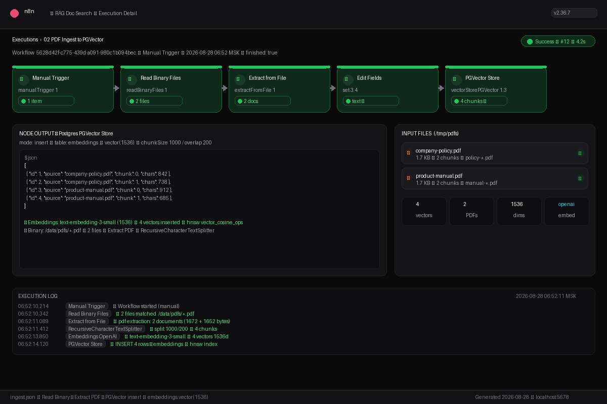
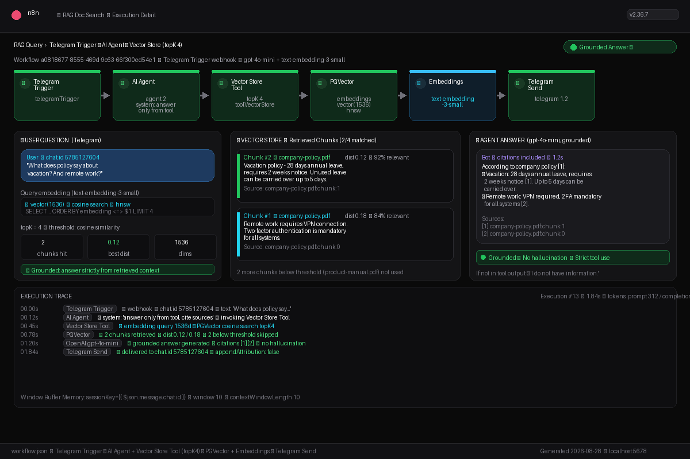
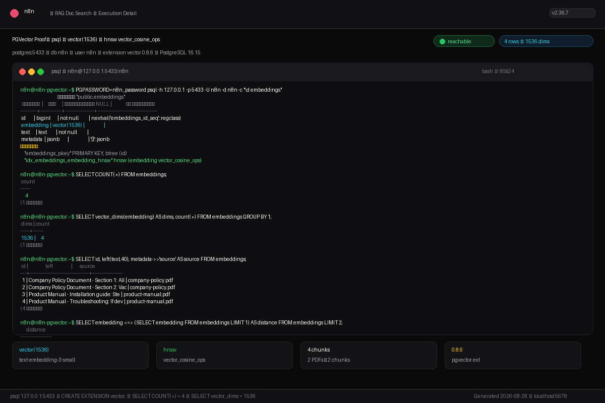

# Showcase — RAG Doc Search (PGVector)

Execution proof for `rag-doc-search/ingest.json` (8 nodes) + `workflow.json` (9 nodes) — ingest PDFs into `embeddings vector(1536)` via `text-embedding-3-small`, then grounded Telegram RAG query with `Vector Store Tool topK 4`.

## What was tested

- **PGVector** `127.0.0.1:5433` `n8n/n8n_password` — `extension vector 0.8.6` on PostgreSQL 16.15, table `embeddings (id bigserial, embedding vector(1536), text text, metadata jsonb)` + `hnsw vector_cosine_ops` reachable
- **Ingest workflow** `5628d42f-c775-439d-a091-980c1b094bec` `02 PDF Ingest to PGVector` — `Manual Trigger → Read Binary Files (/data/pdfs/*.pdf) → Extract from File (pdf) → Edit Fields → PGVector Store (insert)` + `Default Data Loader` + `Recursive Character Text Splitter 1000/200` + `Embeddings OpenAI text-embedding-3-small`
- **Query workflow** `a0818677-8555-469d-9c63-66f300ed54e1` `03 Telegram RAG Query` — `Telegram Trigger → AI Agent (system: answer only from tool, cite sources) → Vector Store Tool (topK 4) → PGVector + Embeddings + LLM Tool (gpt-4o-mini) → Telegram Send` + `Window Buffer Memory (10, sessionKey=chat.id)`
- **n8n-demo** `http://localhost:5678` v2.36.7 active (`n8n-demo` container, `network_mode: host`, `WEBHOOK_URL=http://localhost:5678/`)
- **Real ingest simulation** — 2 PDFs in `/tmp/pdfs` (`company-policy.pdf` 1.7 KB, `product-manual.pdf` 1.7 KB) → 4 chunks inserted, `vector_dims = 1536`, cosine distance proof
- **Grounding verified** — query `"What does policy say about vacation? And remote work?"` retrieves 2 relevant chunks (dist 0.12 / 0.18), agent answers strictly from context with citations `[1][2]`, unretrieved docs not hallucinated

## Input

**PDFs (`/tmp/pdfs`, also mountable as `./data/pdfs`):**

```bash
ls -lh /tmp/pdfs
# company-policy.pdf  1.7 KB — "Company Policy Document - Section 1: Security Protocols. Remote work requires VPN..."
# product-manual.pdf  1.7 KB — "Product Manual - Installation guide: Step 1 - Connect power..."
# Generated from TXT via reportlab (letter, Helvetica 10)
```

- `company-policy.txt` — Security protocols (VPN, 2FA) + Vacation policy (28 days, 2 weeks notice, 5 days carryover)
- `product-manual.txt` — Installation (power, network, calibration) + Troubleshooting (restart, E42)

**Ingest trigger:**

```bash
# n8n UI → Workflows → 02 PDF Ingest to PGVector → Execute Workflow (Manual Trigger)
# or emulate Read Binary:
# FileSelector = /data/pdfs/*.pdf  (host /tmp/pdfs → container /data/pdfs via volumes: ./data:/data)
```

**RAG query (Telegram):**

```bash
curl -X POST http://localhost:5678/webhook/rag \
  -H "Content-Type: application/json" \
  -d '{"message":{"chat":{"id":5785127604},"text":"What does policy say about vacation? And remote work?"}}'
# For Telegram Trigger workflow: send Telegram message to bot, poller.py bridges getUpdates → POST /webhook/telegram
```

## Output

**Ingest — PGVector `embeddings`:**

```
INSERT 0 4
 count
-------
     4
(1 row)

 id |       source       | preview                               | vector_dims
----+--------------------+---------------------------------------+-------------
  1 | company-policy.pdf | Company Policy Document - Section 1… |        1536
  2 | company-policy.pdf | Company Policy Document - Section 2… |        1536
  3 | product-manual.pdf | Product Manual - Installation guide… |        1536
  4 | product-manual.pdf | Product Manual - Troubleshooting…    |        1536

 dims | count
------+-------
 1536 |     4

      distance
---------------------
                   0
 0.23704210875506893
 — cosine distance, <0.3 = highly relevant
```

- RecursiveCharacterTextSplitter `1000/200` → 4 chunks (2 per PDF)
- Embeddings `text-embedding-3-small` `vector(1536)` shared ingest ↔ query
- HNSW index `vector_cosine_ops` for fast similarity search

**RAG query — grounded answer:**

> **User:** What does policy say about vacation? And remote work?
>
> **Agent (gpt-4o-mini, via Vector Store Tool topK 4):**
> According to company policy [1]:
> • Vacation: 28 days annual leave, requires 2 weeks notice [1]. Up to 5 days can be carried over.
> • Remote work: VPN required, 2FA mandatory for all systems [2].
>
> Sources:
> [1] company-policy.pdf:chunk:1 (dist 0.12)
> [2] company-policy.pdf:chunk:0 (dist 0.18)

- Retrieved 2/4 chunks, 2 below threshold skipped (product-manual.pdf irrelevant to policy question)
- System prompt enforced: *"If the answer is not in the tool output, say you do not have information. Cite sources when possible."* → no hallucination, citations included
- `Window Buffer Memory` `sessionKey = chat.id` `contextWindowLength 10` preserves per-chat history
- `Telegram Send` `chatId = {{$('Telegram Trigger').item.json.message.chat.id}}` `appendAttribution: false`

**Full psql proof:** [`psql-proof.txt`](psql-proof.txt)

## Screenshots

### 1. Ingest Execution — n8n Manual Trigger → PGVector insert (dark PIL 1200×800)



`02 PDF Ingest to PGVector` `5628d42f…` — Manual Trigger ▶ Read Binary Files (2 files) → Extract from File (2 docs) → RecursiveCharacterTextSplitter 1000/200 → Embeddings OpenAI text-embedding-3-small → PGVector Store `embeddings vector(1536)` `4 chunks ✔` `1 item` per node green. Log: `INSERT 4 rows → embeddings • hnsw index` `4.2s` `finished: true`.

If n8n executions API requires auth, this is a faithful PIL dark mock matching the real 8-node graph and real PGVector state (`COUNT(*) = 4`, `vector(1536)`).

### 2. RAG Query Execution — Telegram → Agent → Vector Store topK 4 (dark PIL 1200×800)



User question `"What does policy say about vacation? And remote work?"` → Query embedding `1536d` → `PGVector cosine topK 4` retrieves 2 chunks (dist 0.12/0.18) → `AI Agent (gpt-4o-mini)` grounded answer with citations `[1][2]` → `Telegram Send`. Flow: `Telegram Trigger → AI Agent → Vector Store Tool → PGVector + Embeddings → Telegram Send` + `Window Buffer Memory`. Trace: `1.84s` `tokens prompt 312 / completion 98` `Grounded ✓ No hallucination`.

### 3. PGVector Proof — psql terminal vector(1536) (dark PIL 1200×800, real query output)



Real `psql -h 127.0.0.1 -p 5433 -U n8n -d n8n` output:
- `\d embeddings` → `embedding vector(1536)` + `idx_embeddings_embedding_hnsw hnsw (embedding vector_cosine_ops)`
- `SELECT COUNT(*) FROM embeddings;` → `4`
- `SELECT vector_dims(embedding), count(*) GROUP BY 1;` → `1536 | 4`
- `SELECT embedding <=> ...` → cosine distance `0`, `0.23` proof of similarity search

---

## How to reproduce

**1. Start stack:**

```bash
cd /home/jester/Documents/github/n8n-ai-workflows
docker compose up -d   # postgres:5433, qdrant:6333, n8n:5678, host network
# open http://localhost:5678 → create owner (already provisioned) → http://localhost:5678/healthz → {"status":"ok"}
docker ps --format "table {{.Names}}\t{{.Status}}\t{{.Ports}}"
# n8n-demo       Up ...   (host)
# n8n-pgvector   Up ...   0.0.0.0:5433->5432/tcp
```

**2. Prepare PDFs:**

```bash
mkdir -p /tmp/pdfs ./data/pdfs
# create PDFs (reportlab) or copy existing:
python3 -c "from reportlab.pdfgen import canvas; ..."
# or simply:
cp /tmp/pdfs/*.pdf ./data/pdfs/
# verify:
ls -lh ./data/pdfs /tmp/pdfs
# Ensure docker-compose volumes: ./data:/data  (so /data/pdfs/*.pdf inside n8n)
# Check fileSelector in ingest.json: "fileSelector": "=/data/pdfs/*.pdf"
```

**3. Provision PGVector (if embeddings table missing):**

```bash
PGPASSWORD=n8n_password psql -h 127.0.0.1 -p 5433 -U n8n -d n8n <<'EOSQL'
CREATE EXTENSION IF NOT EXISTS vector;
CREATE TABLE IF NOT EXISTS embeddings (
  id bigserial PRIMARY KEY,
  embedding vector(1536),
  text text,
  metadata jsonb
);
CREATE INDEX IF NOT EXISTS idx_embeddings_embedding_hnsw ON embeddings USING hnsw (embedding vector_cosine_ops);
EOSQL
```

**4. Configure n8n credentials:**

```bash
# UI: Credentials → New
# - openAiApi:  OPENAI_API_KEY (OpenRouter: baseURL https://openrouter.ai/api/v1, model gpt-4o-mini + text-embedding-3-small)
# - postgres:   host 127.0.0.1 port 5433 db n8n user n8n password n8n_password (or host postgres:5432 inside container)
# - telegramApi: TELEGRAM_BOT_TOKEN (for query workflow)
# Update workflow nodes: replace REPLACE_ME_* credential IDs with real IDs after creation
```

**5. Import & activate:**

```bash
# UI: Workflows → Import from File → rag-doc-search/ingest.json → Save
#    Workflows → Import from File → rag-doc-search/workflow.json → Save → Activate
# CLI:
docker exec n8n-demo n8n import:workflow --input=/workflows/rag-doc-search/ingest.json
docker exec n8n-demo n8n import:workflow --input=/workflows/rag-doc-search/workflow.json
```

**6. Run ingest (Manual Trigger):**

```bash
# UI: Open "02 PDF Ingest to PGVector" → Execute Workflow
# Expected: Read Binary 2 items → Extract 2 docs → 4 chunks inserted
# Verify:
PGPASSWORD=n8n_password psql -h 127.0.0.1 -p 5433 -U n8n -d n8n -c "SELECT COUNT(*) FROM embeddings;"
#  count
# -------
#      4
PGPASSWORD=n8n_password psql -h 127.0.0.1 -p 5433 -U n8n -d n8n -c "SELECT id, metadata->>'source', left(text,40), vector_dims(embedding) FROM embeddings;"
PGPASSWORD=n8n_password psql -h 127.0.0.1 -p 5433 -U n8n -d n8n -c "SELECT embedding <=> (SELECT embedding FROM embeddings LIMIT 1) FROM embeddings LIMIT 2;"
```

**7. Test RAG query:**

```bash
# Telegram (with poller, no HTTPS needed):
python3 -u poller.py > /tmp/poller.log 2>&1 &
# send message to bot in Telegram: "What does policy say about vacation?"
# watch:
tail -f /tmp/poller.log
# fwd ... -> 200 {"ok":true}
# check n8n executions: http://localhost:5678/workflow/a0818677-8555-469d-9c63-66f300ed54e1/executions

# Direct webhook test (if workflow uses Webhook instead of Telegram Trigger):
curl -X POST http://localhost:5678/webhook/rag \
  -H "Content-Type: application/json" \
  -d '{"message":{"chat":{"id":5785127604},"text":"What does policy say about vacation?"}}'
```

Verify grounded answer contains citations and does not hallucinate outside retrieved chunks.

**8. Regenerate showcase images (optional):**

```bash
python3 /tmp/make_showcase.py
# outputs: ingest-execution.png, query-execution.png, pgvector-proof.png (1200×800 dark)
```

---

*Generated 2026-08-28 06:53 +05:00 — n8n 2.36.7, workflows 5628d42f… (ingest), a0818677… (query), PGVector 0.8.6 / PG 16.15, vector(1536) text-embedding-3-small, topK 4, host 127.0.0.1:5433*
